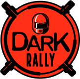
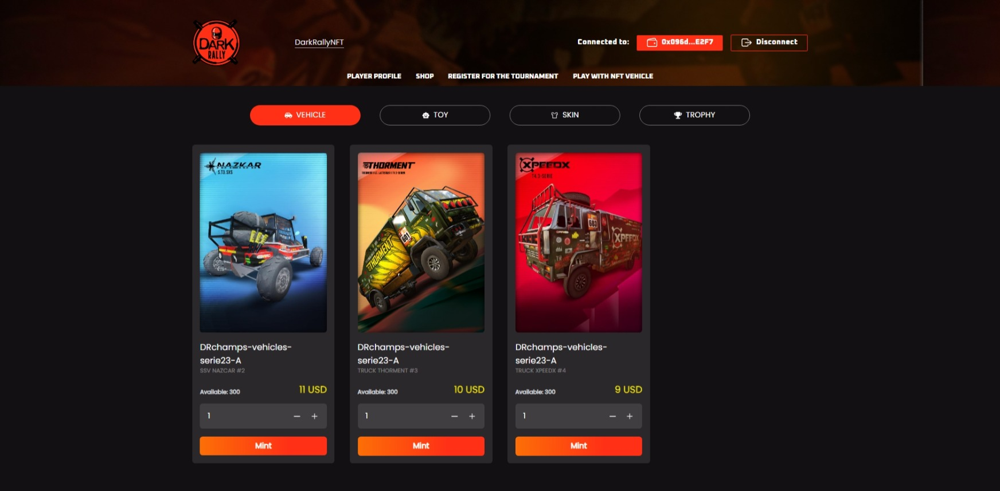

<p align="center">
    <picture>
      <source media="(prefers-color-scheme: dark)" srcset="./public/images/logo.png">
      
    </picture>
    <h1 align="center">Dark Rally Web3</h1>
</p>


Project to integrate Dark Rally game and blockchain via web3.

<!-- TABLE OF CONTENTS -->
<details>
  <summary>Table of Contents</summary>
  <ol>
    <li>
      <a href="#about-the-project">About The Project</a>
    </li>
    <li>
      <a href="#usage">Usage</a>
      <ul>
        <li><a href="#pre-requisites">Pre-Requisites</a></li>
        <li><a href="#installation">Installation</a></li>
        <li><a href="#environment-variables-configuration">Environment Variables Configuration</a></li>
        <li><a href="#development">Development</a></li>
        <li><a href="#build-and-deploy">Build and deploy</a></li>
      </ul>
    </li>
  </ol>
</details>

## About The Project



The project includes the following:

- Web interface of the application.
- Functionality of connection to the web3 wallet through the sequence service.
- First steps of the NFTs minting function.
- First steps of the NFTs metadata retrieval function.

## Usage

### Pre-Requisites

System Requirements:

- Node.js 18.17 or later.
- macOS, Windows (including WSL), and Linux are supported.

### Installation

1. Clone the repo
```bash
git clone https://github.com/PLOPstudiodev/DARK_RALLY_WEB3_mobile.git
```
2. Install dependencies
```bash
npm install
```
3. Create .env file in the root directory
4. Copy the contents of the .env.example file to the .env file

### Environment Variables Configuration 

For the correct functioning of the web, the following environment variables must be configured.

- `NEXT_PUBLIC_CHAIN_ID`: Is the blockchain network that is configured in sequence to use smart contracts.

- `NEXT_PUBLIC_SHOP_COIN_CONTRACT_ADDRESS`: Is the contract address of the coin to be used for NFTs transactions.

- `NEXT_PUBLIC_NFT_CONTRACT_ADDRESS`: Is the contract address of the Vehicle NFTs shown on the website.

- `NEXT_PUBLIC_SIGNER`: Signer address for the mint function.

- `NEXT_PUBLIC_PROJECT_ACCESS_KEY`: Acess key of the project created in the sequence interface.

- `NEXT_PUBLIC_AUTHORIZATION_TOKEN`: Bearer token generated to access the Sequence endpoints.

### Development

First, run the development server:

```bash
npm run dev
```

Open [http://localhost:3000](http://localhost:3000) with your browser to see the result.

### Build and deploy

1. To compile the project use the command: 
```bash
npm run build
```
2. To execute the web server use the command: 
```bash
npm run start
```
